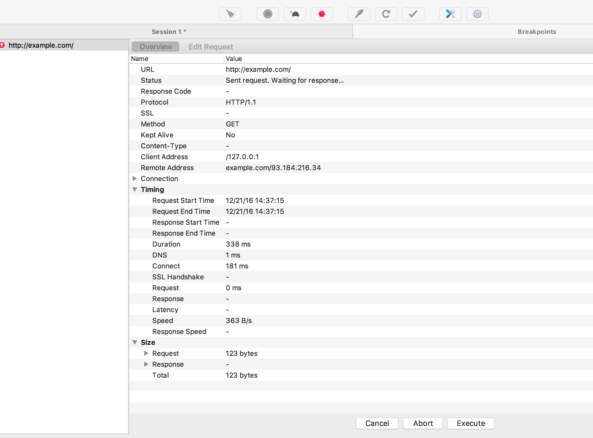
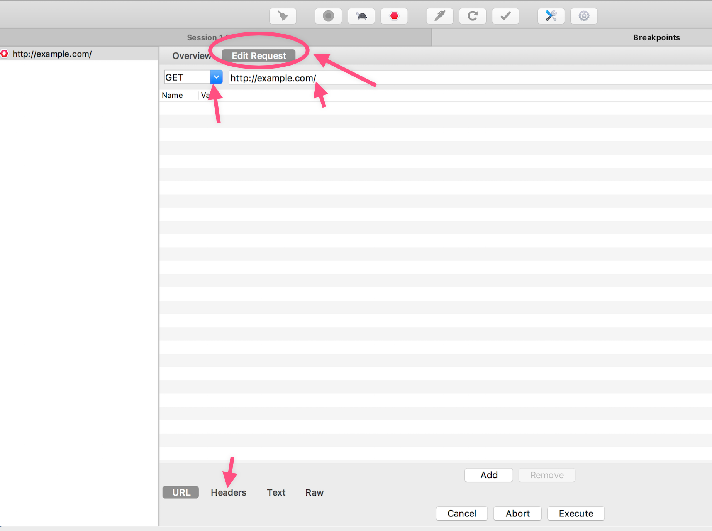
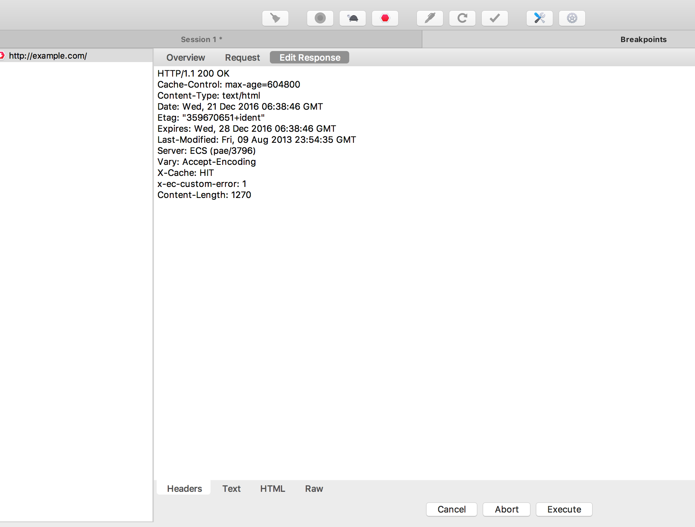
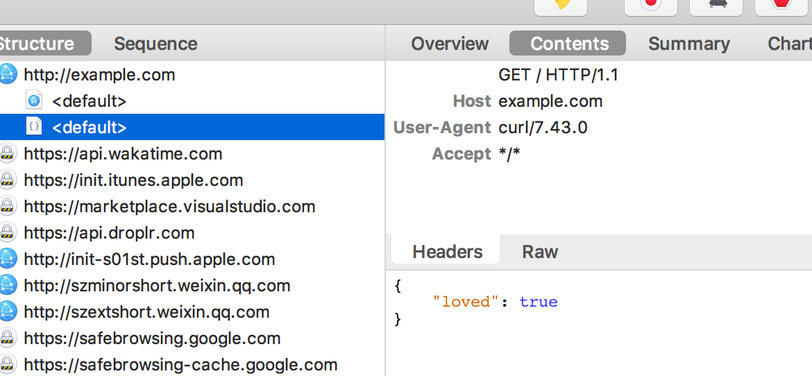
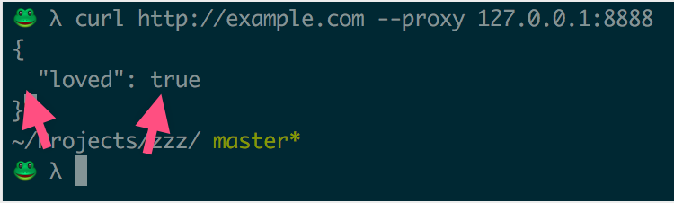

# 修改网络请求

很多时候由于后台的接口没完成，我们需要等待。这个时候，我们就可以利用 Charles 修改请求的响应正文，返回我们想要的数据。

接下来，我们会以 `example.com` 为例，让他返回一个 JSON ，而不是默认的 HTML 。

```javascript
{
  "loved": true
}
```


## 设断点

在左侧栏，右击「请求域名」-> *Breakpoints* && 顶部工具栏 *Enable Breakpoints*


此时，我们向 `example.com` 发起一个 HTTP 请求：

```bash
curl http://example.com --proxy 127.0.0.1:8888
```

Charles 就会捕捉到，呈现一下页面：




## 修改请求正文

点击 **Edit Request** ：



在这里，你可以修改请求正文，比如加个请求头部，修改请求方法 `GET` 为 `POST` ……

修改完后，点击底部的 **Execute** ，发送请求。接下来会看到默认的响应正文：




## 修改响应正文

我们的目的是把他修改为 JSON（把 `Content-Type` 修改为 `application/json` ）:


点击 **Edit Response** ：


最后点击底部的 **Execute** ，可以看到最后的响应被修改为了如下：



`curl` 返回的结果：



## 总结
综上，我们不难得到：

利用 Charles ，我们可以很好地控制 HTTP 请求和对应的响应，这样一来，我们测试以及调试就变得简单得多了，比如**测试某些特殊值**的时候，就不需要后台修改数据库。