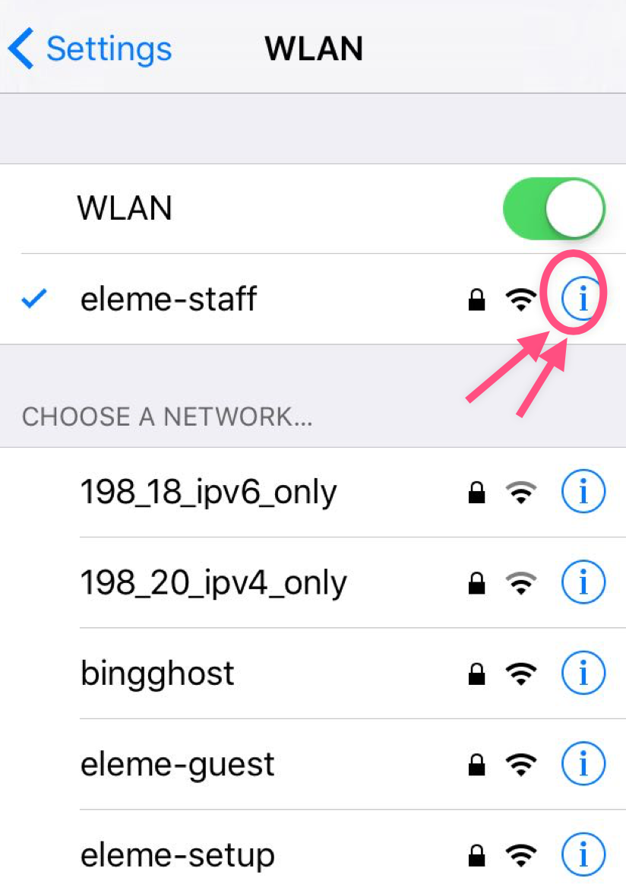
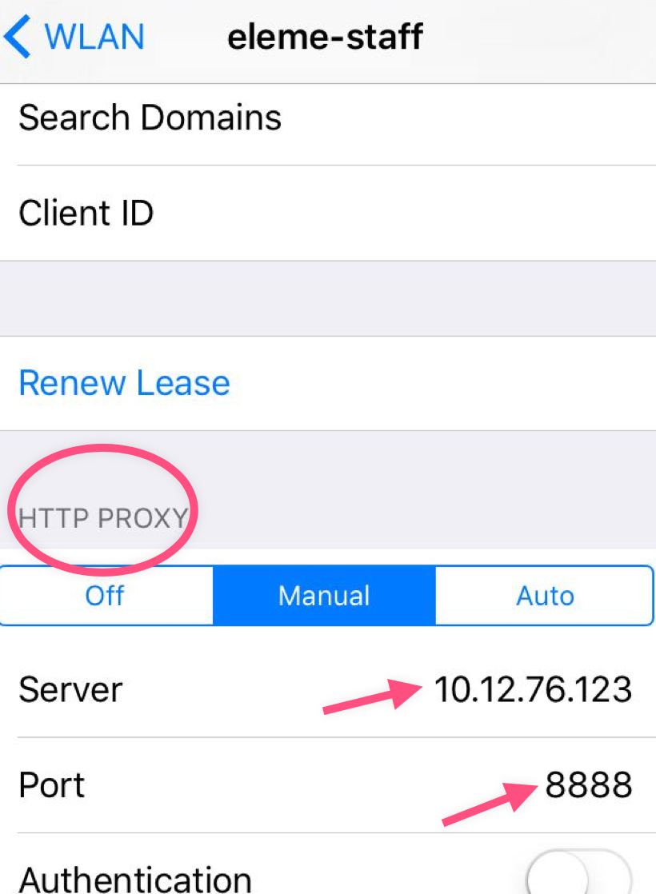
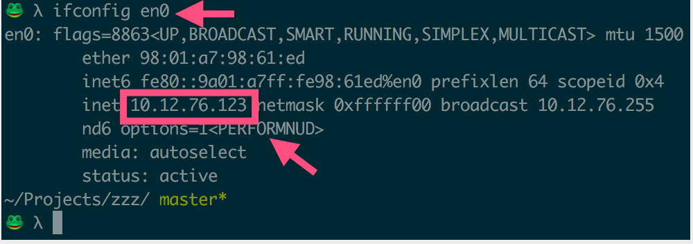

# 代理手机上的网络请求
如果我们想调试手机上的应用，可以把请求转发到 PC 上，然后由 Charles 来捕获。

## Charles设置
顶部菜单栏 -> *Proxy* -> *Proxy Settings* -> *Proxies* -> 勾上 Enable transparent HTTP proxying

## 手机设置
为了把手机的请求转发到 PC 上，我们要保证手机和 PC 是在同一个局域网的。所以他们要连接同一个 Wi-Fi 。

然后，打开你手机的 Wi-Fi 设置：

接着，把 HTTP Proxy 设置为你 PC 的系统代理，也就是上一步设置的 Charles 的 Proxy Setting 。

`server` 的值是你 PC 上的 IP 地址：`ifconfig en0`

搞定之后，PC 上就会有一个弹框，问你是否允许手机代理到该 PC 上：

点击「允许」就好。

然后手机上随便发起一个 HTTP 请求，Charles 都可以捕获得到，比如打开饿了么的 APP :

