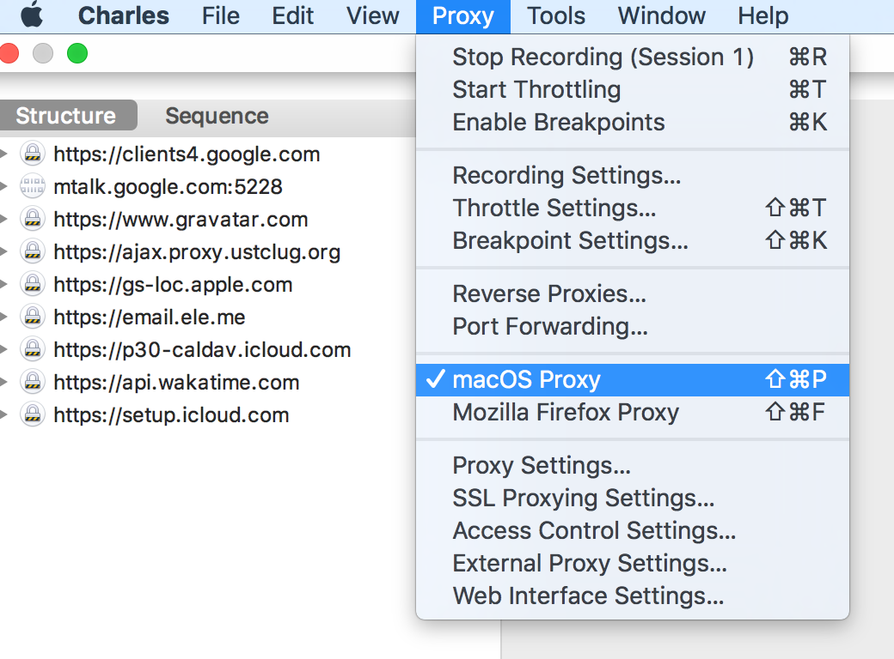
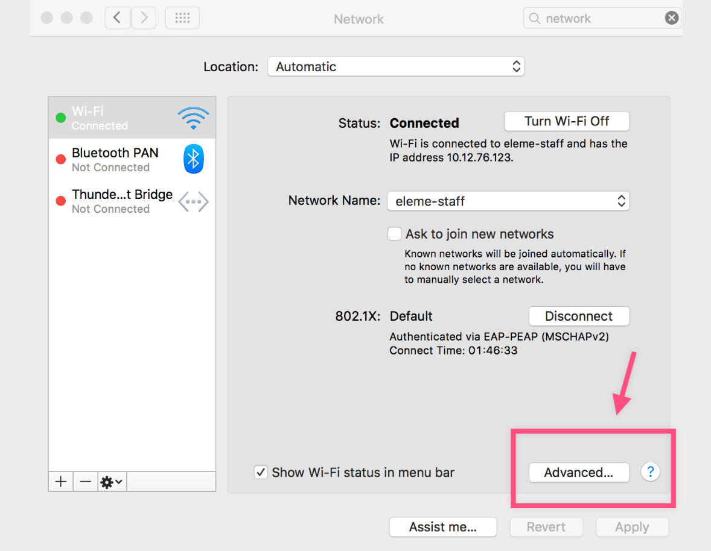
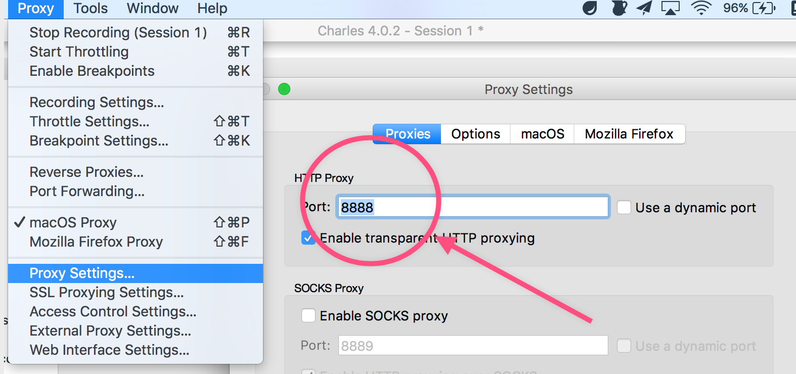

## 设置为系统代理

首次启动，如果你的操作系统是 macOS 的话，他会提示你是否把他设为「系统代理」。如果不小心按了「否」的话，没关系，可以手动地设置：

顶部菜单栏 -> *Proxy* -> *macOS Proxy*



如果设置成功的话，我们打开：

*system Preferences* -> *Network* -> 当前网络的 *Advanced* -> *Proxy*



可以看到我们系统的 HTTP 请求代理到了 `127.0.0.1:8888`：


这个 `127.0.0.1:8888` 和 Charles 上的 Proxy Setting 是一致的：



所以，只要把 HTTP 请求发送到 `127.0.0.1:8888` 的话，Charles 就可以捕捉这些请求。

```bash
curl http://example.com --proxy 127.0.0.1:8888
```


### See also

* [Getting Started](https://www.charlesproxy.com/documentation/getting-started/)
* [Browser & System Configuration
](https://www.charlesproxy.com/documentation/configuration/browser-and-system-configuration/)